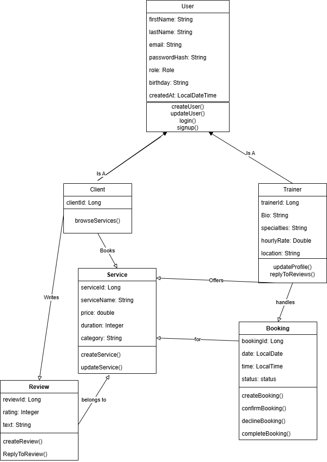

# FitMatch - Backend API Documentation

**Version:** 1.0
**Last Updated:** March 24, 2026
**Base URL:** `http://localhost:8080/api`

---

## Table of Contents

1. [Overview](#1-overview)
2. [User Roles](#2-user-roles)
3. [UML Class Diagram](#3-uml-class-diagram)

## 1. Overview
The FitMatch Backend API provides a RESTful interface for managing: 

- **User Accounts**: Client, Trainer
- **User Profiles**: Information about trainers/ information about clients.
- **Services**: Trainer offered Services 
- **Bookings**: Client bookings to different trainer services
- **Reviews**: Customer feedback on freshness and delivery experiences

---
## 2. User Roles
The API supports three primary user roles:

| Role | Description | Primary Responsibilities |
|------|-------------|-------------------------|
| **Client** | Consumer of services | Browse services, book, write reviews |
| **Trainer** | Provider of services | Create/manage services, manage booking requests, reply to reviews |

---
## 3. UML Class Diagram

